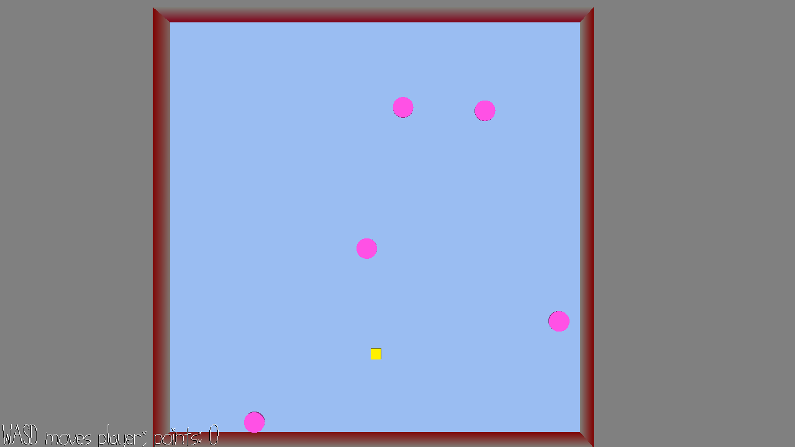

# Chase

Author: Haidar Jamal

Design: You have to try to find the AI to poke if they are making sound. Then you have to run away until the AI gives up.

Screen Shot:

How To Play:

WASD to move the player. Spacebar to annoy the AI. Run away for 5 seconds.

Sources:  
Busybody, written by Bryan Teoh: https://freepd.com/music/Busybody.mp3.  
GoodNightmare, Written by Kevin MacLeod: https://freepd.com/music/Goodnightmare.mp3  
jabbersynth by: Saltbearer https://freesound.org/people/Saltbearer/sounds/536423/  

This game was built with [NEST](NEST.md).

